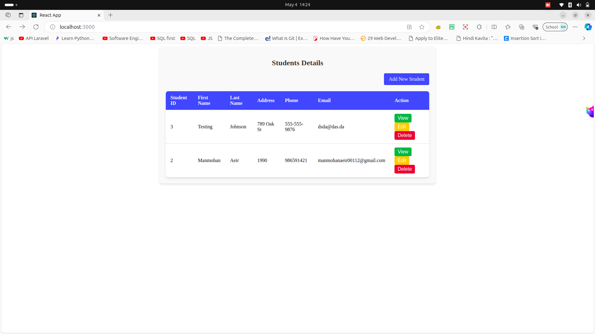
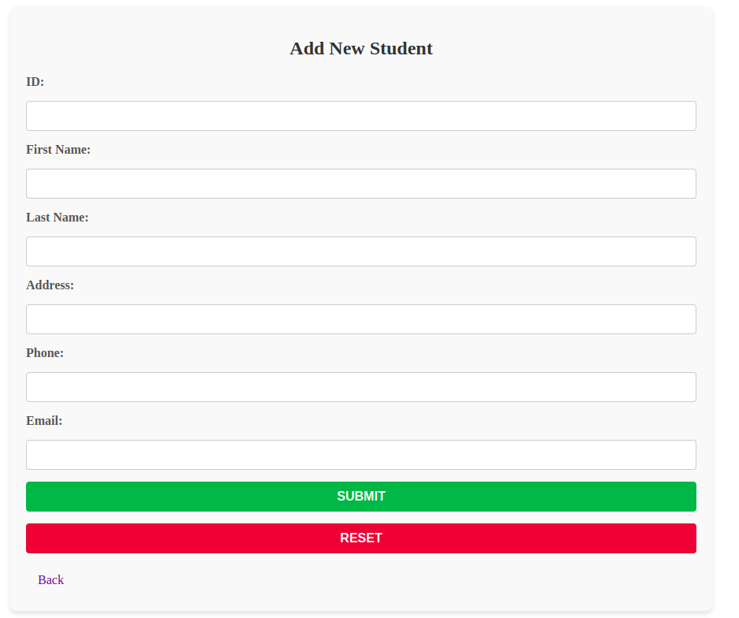
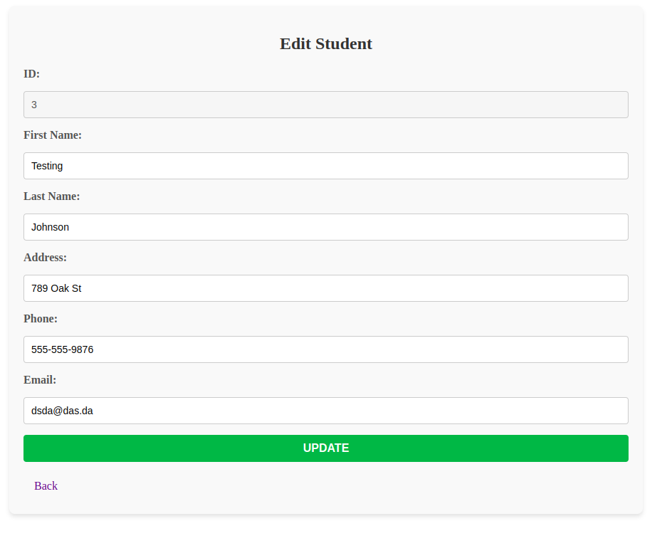
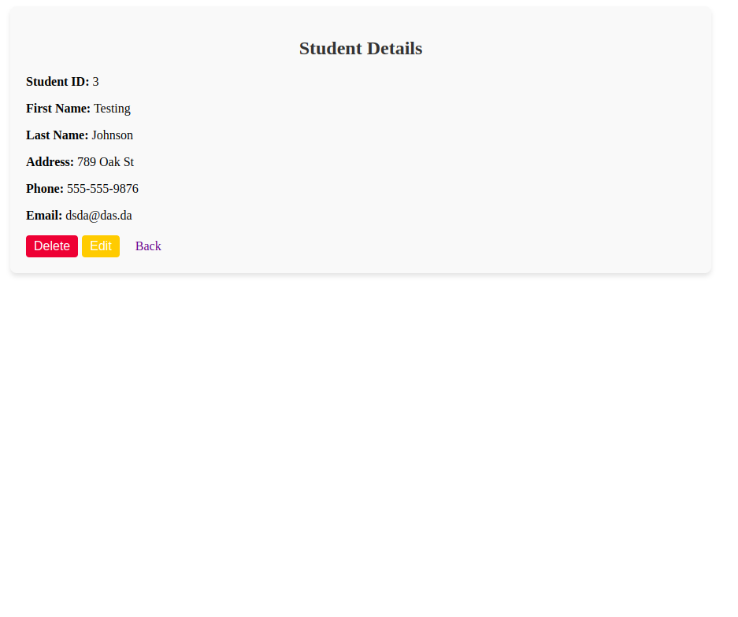

# Getting Started with Create React App

This project was bootstrapped with [Create React App](https://github.com/facebook/create-react-app).

## Available Scripts

In the project directory, you can run:

### `npm start`

Runs the app in the development mode.\
Open [http://localhost:3000](http://localhost:3000) to view it in your browser.

The page will reload when you make changes.\
You may also see any lint errors in the console.
 

 ## Overview
The `App` component defines the routing structure for the application. It uses the `BrowserRouter`, `Routes`, and `Route` components from `react-router-dom` to map different URL paths to their respective React components.

## Routes Defined

### 1. **Root Route (`/`)**
- **Path**: `/`
- **Component Rendered**: `StudentTable`
- **Purpose**: Displays the main page with a table of students.

---

### 2. **Create Student Route (`/student/create`)**
- **Path**: `/student/create`
- **Component Rendered**: `CreateStudent`
- **Purpose**: Provides a form to add a new student to the system.

---

### 3. **Edit Student Route (`/student/edit/:std_id`)**
- **Path**: `/student/edit/:std_id`
- **Component Rendered**: `EditStudent`
- **Purpose**: Allows editing the details of a specific student. The `:std_id` parameter represents the ID of the student to be edited.

---

### 4. **View Student Route (`/student/view/:std_id`)**
- **Path**: `/student/view/:std_id`
- **Component Rendered**: `EditStudent` (currently)
- **Purpose**: Intended for viewing the details of a specific student. However, it currently uses the `EditStudent` component, which may need to be replaced with a dedicated `ViewStudent` component.

---


# 📦 JSON Server Setup Guide

`json-server` is a full fake REST API that you can set up in less than a minute. It's great for prototyping and front-end development.

---

## 🚀 Features
- RESTful routes (`GET`, `POST`, `PUT`, `DELETE`)
- Watch for changes in `db.json`
- Serve your data instantly with zero back-end code

---

## ✅ Prerequisites
- Node.js **v20 or higher** (recommended)
- npm (comes with Node.js)

---

## 🔧 Installation

Install `json-server` globally using npm:

```bash
npm install -g json-server

```

# JSON Server Configuration and `db.json` Documentation

This project uses **JSON Server** as a mock backend to manage student data. The `db.json` file acts as the database for the JSON Server.

---

## File Path
` /student_management/db.json`

---

## Overview
The `db.json` file contains a collection of student records stored in JSON format. JSON Server uses this file to simulate a RESTful API, allowing the React application to perform CRUD operations (Create, Read, Update, Delete) on the student data.

---

## Sample Data Structure
The `db.json` file contains a `students` array, where each object represents a student with the following fields:

- **id**: Unique identifier for the student.
- **firstName**: The first name of the student.
- **lastName**: The last name of the student.
- **address**: The address of the student.
- **phone**: The phone number of the student.
- **email**: The email address of the student.

### Example:
```json
{
    "students": [
        {
            "id": 1,
            "firstName": "John",
            "lastName": "Doe",
            "address": "123 Main St",
            "phone": "555-555-5555",
            "email": "man@gmail.com"
        },
        {
            "id": 2,
            "firstName": "Jane",
            "lastName": "Smith",
            "address": "456 Elm St",
            "phone": "555-555-1234",
            "email": "jane@gmail.com"
        }
    ]
}
```

# 🧠 React State Management with `useState`

In React, **state** refers to data that changes over time and affects what gets rendered to the UI.

---

## 🔧 What is `useState`?

`useState` is a **Hook** that lets you add React state to function components.

```js
const [stateVariable, setStateVariable] = useState(initialValue);

-state: The current value of the state.

-setState: A function to update the state.

-initialValue: The initial value of the state variable.

```

#  What is : `useParams` in React Router

The `useParams` hook is a part of the `react-router-dom` library and is used to access dynamic parameters from the URL in a React application. This documentation explains how `useParams` is utilized in the `ViewStudent` component.

---

## File Path
` /student_management/src/ViewStudent.jsx`

---

## Overview of `useParams`

The `useParams` hook allows you to extract route parameters from the URL. These parameters are typically defined in the route configuration using a colon (`:`) followed by the parameter name.

### Syntax:
```jsx
const params = useParams();
```

## 📸 Screenshot Representation of Index and CRUD Pages


- Index Page


- Create Page


- Edit Page 


- View Page 



